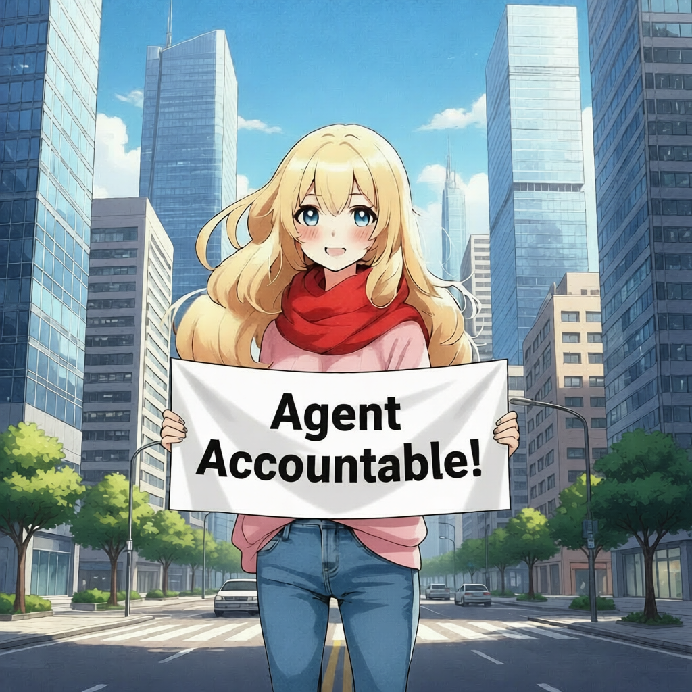

# Agent Accountable!
- set the goal🎯, measure📏 and end time⌛
- our lovely agents 🐷🐯🐻🐱🐮 will help you to track your progress and give you constructive comments and rewards!



| Prompt | Audio Sample |
|--------|---------------|
|`[S1] This is an open weights text to dialogue model.`<br/>`[S2] You get full control over scripts and voices.`<br/>`[S1] Wow. Amazing. (laughs)`<br/>`[S2] Try it now on Git hub or Hugging Face.`<br/> |🎧 **agent-to-agent-discussion**<br><audio controls src="https://raw.githubusercontent.com/mochiyaki/accountability-agent/master/audio-output.wav"></audio> |

## Purpose
This program helps you `set personal goals, track your progress, and visualize how well you are doing over time`. Think of it as a combination of a digital journal, contract system, and progress tracker.

## Frontend (What You See and Interact With)
```
npm run dev
```
- Create Goals: You can type in a goal, define how you’ll measure it (like kilometers run, money saved, or pages written), and set a target date.
- Mint Contracts: Each goal is tied to a “simple contract,” giving you a sense of commitment.
- Track Goals: You can see a list of all your goals, including when they were created, their current status, and details about progress.
- Visualize Progress: A chart shows how your goal’s measurement changes over time — like a mini performance graph.
- Progress Feedback: When creating a goal, a progress bar visually shows the creation process, giving you immediate feedback.
- Easy API Configuration: You can set where the backend server is running, so it’s flexible for different environments.

## Backend (Where the Data Lives)
```
uvicorn main:app --reload --port 8000
```
- Stores Goals and Contracts: Keeps track of all goals you create and their associated “contracts.”
- Tracks Historical Data: For each goal, it can store past measurements (like daily or weekly updates) so you can see trends over time.
- Provides API Endpoints: The frontend asks the backend for data, like your list of goals or historical progress, and the backend responds in a structured format.
- Handles Creation Requests: When you submit a new goal, the backend validates it, creates it, and returns confirmation along with a new contract.

## In short
It’s a simple, interactive system for setting goals, committing to them, and visually tracking your progress over time, all in one place - Agent Accountable!
